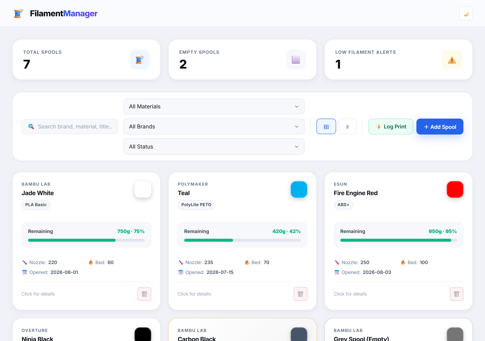
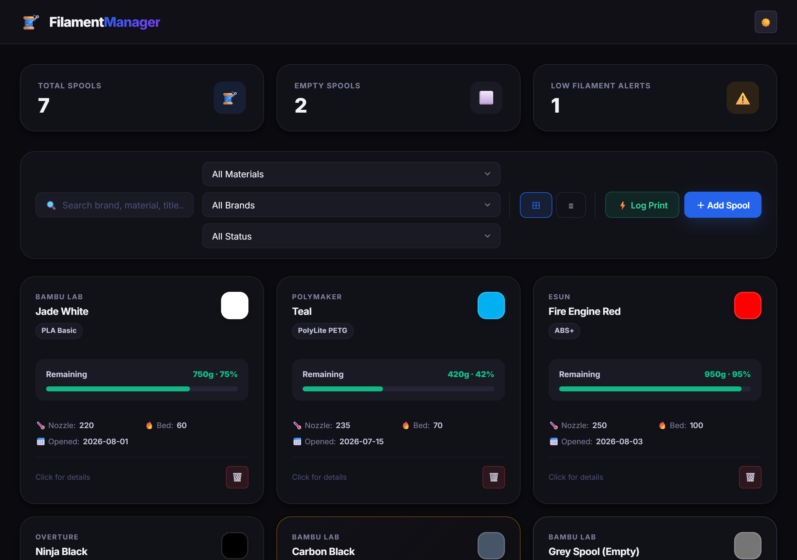
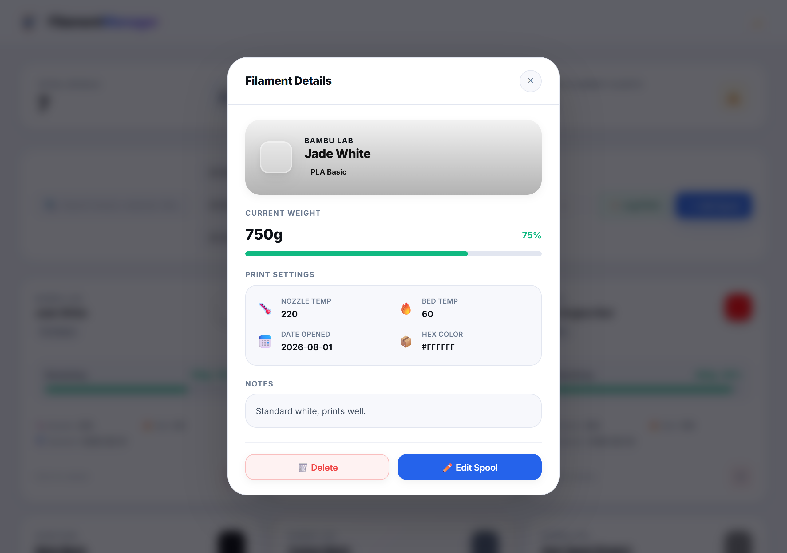
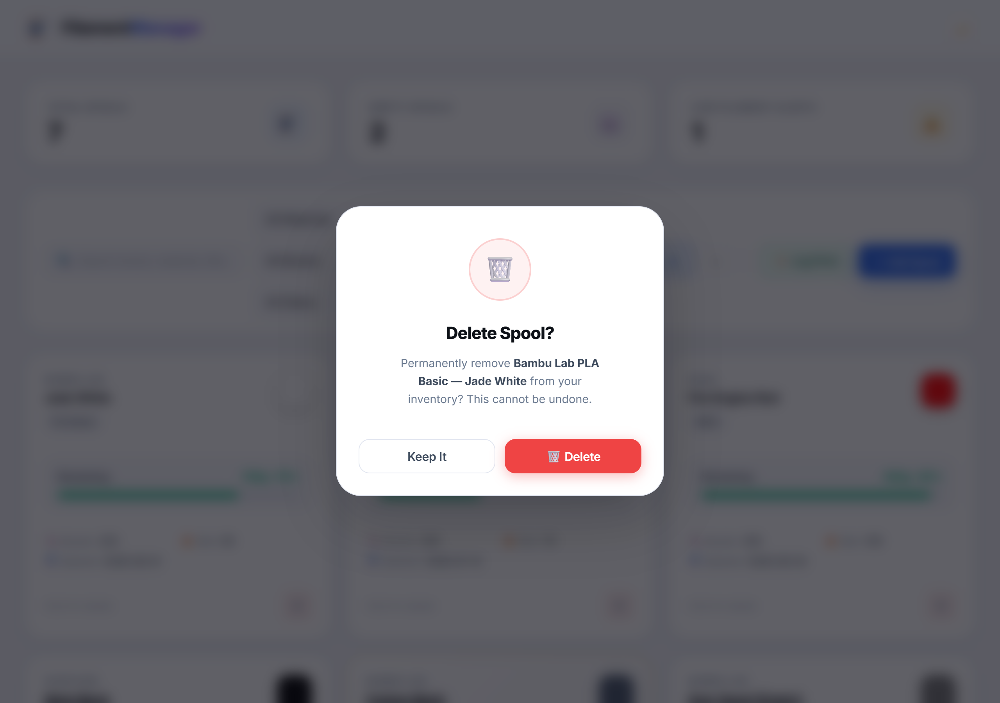
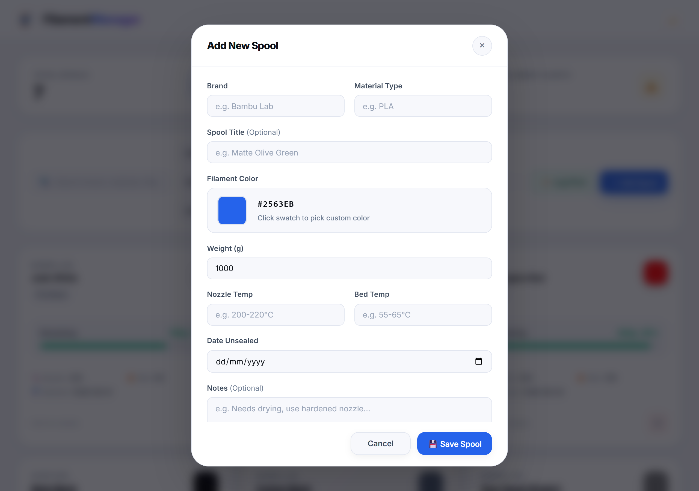
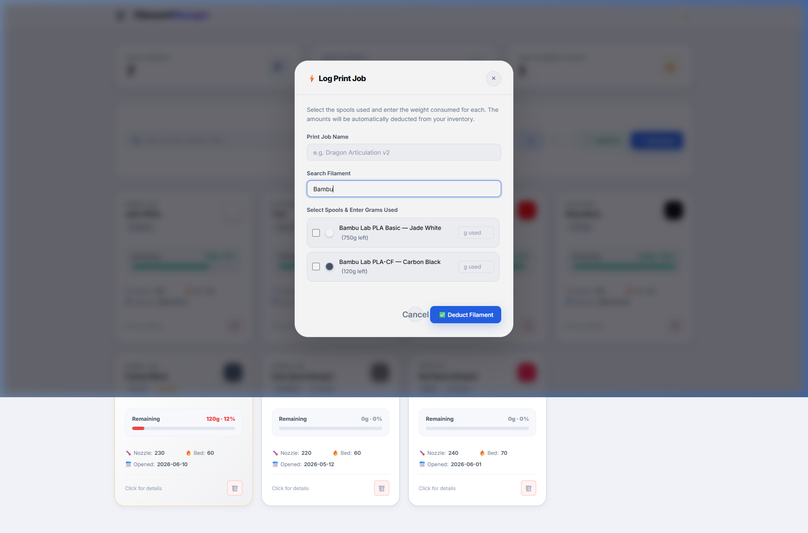

# 🧵 Filament Manager

A modern, local-first dashboard for tracking your 3D printing filament inventory.
No cloud required — your data lives in a SQLite database on your own PC.

---

## 🚀 Quick Start — Double Click to Launch

**No terminal needed.** Just double-click the launcher file:

```
📂 Filament Manager\
  └── 🖱️ Filament Manager.bat   ← Double-click me!
```

The launcher will:
1. Check that Node.js is installed
2. Install dependencies automatically on first run
3. Start the **SQLite database backend** on port `3001`
4. Start the **web interface** on port `5173`
5. **Open your browser** automatically at `http://localhost:5173`

> ⚠️ Keep the command window open while using the app. Closing it stops the servers.

---

## ✨ Features

| Feature | Description |
|---------|-------------|
| 🗄️ **SQLite Database** | Data stored locally in `filament.db` — no cloud, no account |
| 🌙 **Dark & Light Mode** | Toggle theme instantly from the top-right button on the header |
| ⊞ **Grid & List View** | Switch between spacious card grid and compact list layout |
| 🔍 **Search & Filters** | Filter spools by brand, material type, or stock status |
| ⚡ **Multi-Spool Print Logging** | Log print jobs and deduct weights from multiple spools at once |
| 🎨 **Native Color Picker** | Integrated color picker to choose any custom color for your filament |
| ⚖️ **Single Weight Field** | Simple weight input (g) — no confusing initial and remaining fields |
| 👁️ **Filament Details View** | Click cards to view gorgeous, modern info sheets with specs and notes |
| 🔍 **Print Modal Search** | Filter and find spools inside the print log modal in real-time |
| ⚠️ **Low & Empty Alerts** | Metric cards show spools that are low (<15% or <150g) or fully empty |
| 🗑️ **Custom Delete Dialog** | Beautiful animated confirmation dialog instead of browser popup |
| 📱 **Auto-Adjusting Modals** | Zero-glitch scrolling and auto-scaling across all tab and window sizes |

---

## 🖥️ Interface Overview

### 📊 Dashboard (Light & Dark Theme)

Redesigned header is simple, modern, and easy to use:
- Displaying brand logo `🧵 FilamentManager` with gradient accent text
- Sleek, floating glassmorphism navbar with theme toggle (🌙 / ☀️)
- **Metric Cards** show:
  - **Total Spools**: Count of all spools in your inventory
  - **Empty Spools**: Count of spools with `0g` remaining
  - **Low Filament Alerts**: Spools that are running low but not empty

#### ☀️ Light Mode


#### 🌙 Dark Mode


---

### 👁️ Filament Details View

Clicking any filament card displays a sleek, modern details panel with:
- A colored header card matching the exact filament hex color
- Live weight metrics and colored progress bar
- Nozzle temperature, bed temperature, date opened, hex color code, and notes
- Auto-adjusts cleanly based on tab size with smooth inner scrolling and zero clipping



---

### 🗑️ Custom Delete Confirmation Dialog

Instead of the browser's native `confirm()` popup, deleting a spool triggers a custom animated modal:
- **Red accent top border** to signal danger clearly
- **Spring-physics animated 🗑️ icon** inside a danger-tinted badge
- **Exact spool name displayed in the message** to prevent accidental deletions
- **"Keep It"** (secondary) vs. **"🗑️ Delete"** (solid red action button)



---

### ➕ Add & Edit Spool Form

- **Brand & Material Type**: Free-text fields with auto-suggestions based on existing filaments
- **Filament Color**: Integrated native color picker with live hex code preview
- **Weight (g)**: Single clean weight input (g)
- **Properly designed footer**: Symmetrical **Cancel** and **💾 Save Spool** buttons



---

### ⚡ Multi-Spool Print Logging (with Live Search)

Log print jobs and deduct weights easily:
- **Deduct from Multiple Spools**: Perfect for multi-material prints
- **Live Spool Search**: Real-time filter by brand, material, or name
- **Gram Input per Spool**: Enter the exact amount used for each selected spool



---

## 🌱 Pre-loaded Sample Data

Seeded with **7 sample spools** (including 2 empty spools):

| Brand | Material | Title | Color | Remaining | Status |
|-------|----------|-------|-------|-----------|--------|
| Bambu Lab | PLA Basic | Jade White | ⬜ White | 750 g | Active |
| Polymaker | PolyLite PETG | Teal | 🔵 Teal | 420 g | Active |
| eSUN | ABS+ | Fire Engine Red | 🔴 Red | 950 g | Active |
| Overture | TPU 95A | Ninja Black | ⬛ Black | 1000 g | Active |
| Bambu Lab | PLA-CF | Carbon Black | 🩶 Carbon | 120 g | ⚠️ Low |
| Bambu Lab | PLA Basic | Grey Spool | 🩶 Grey | 0 g | ⬜ Empty |
| Creality | PETG | Red Spool | 🔴 Red | 0 g | ⬜ Empty |

---

## 🛠️ Technical Details

- **Frontend**: Vanilla JavaScript (ES Modules) + Vite 5
- **Backend**: Node.js 22 + Express + `node:sqlite` (built-in SQLite)
- **Database File**: `filament.db` (auto-created on first run)
- **Ports**: Frontend `5173`, Backend `3001`

---

## 🐛 Bug Fixes & Changelog

### v1.4 — Modal Auto-Adjustment & Smooth Scrolling Fix
- **Fixed**: Filament details and modal scrolling issues on resized browser tabs / smaller screens.
- **Architecture**:
  - Migrated modals to a pure **Flexbox column architecture** (`modal-content` is flex-column, `modal-body` handles `overflow-y: auto`).
  - Removed glitchy `position: sticky` headers and footers that caused jumpy / clipping artifacts during scroll.
  - Eliminated negative-margin hacks on the detail banner so it renders as a clean, rounded banner card.
  - Added `@media (max-height: 700px)` rules to seamlessly scale down modal padding and elements when the tab height is reduced.
  - Content fits with **zero scrollbars needed on full-screen / standard displays**, and **smooth, glitch-free scrolling on smaller tabs or laptop screens**.

### v1.3 — Custom Delete Dialog
- **New**: Replaced the browser's native `confirm()` popup with a beautiful custom animated modal
  - Spring-physics animated trash icon
  - Shows the exact spool name in the message
  - Solid red "Delete" button and secondary "Keep It" cancel button
  - Works from both the card 🗑️ button and the Details modal Delete button

### v1.2 — Delete Button Fix
- **Fixed**: The 🗑️ delete button on inventory cards was blocked by an inline `onclick="event.stopPropagation()"` attribute
- **Fix**: Removed the inline handler; `main.js`'s event delegation already handles the `else if` branching correctly

### v1.1 — UI Overhaul
- Replaced 48-color grid with native color picker
- Consolidated Initial/Remaining weight into a single **Weight (g)** field
- Card click now shows a modern **Filament Details** sheet (not edit form directly)
- Added live spool search inside Log Print modal
- Added 2 pre-loaded empty spools in sample database
- Redesigned header: clean, floating, borderless
- Improved Cancel/Save button layout and spacing in all modals
